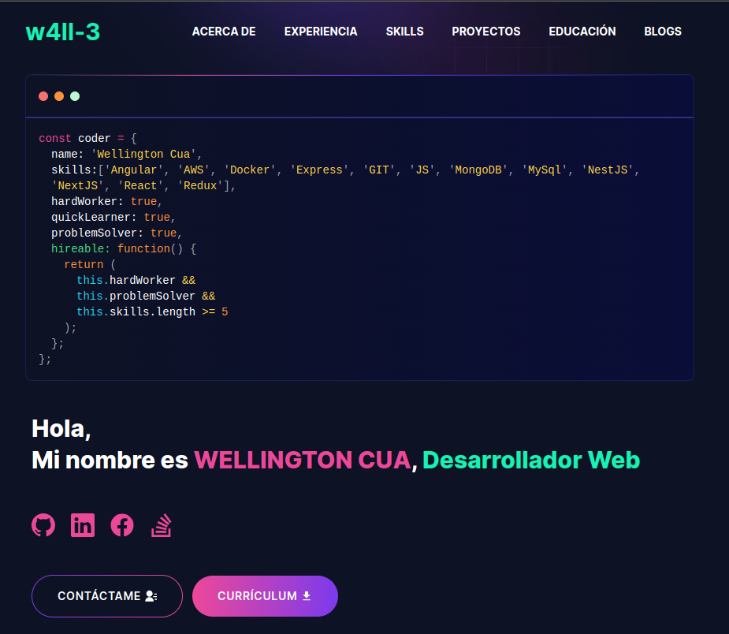

# Desarrollador Frontend

### Hola 👋 soy Wellington. Soy un desarrollador frontend autodidacta. Me encanta aprender cosas nuevas y siempre estoy abierto a colaborar con otros. Aprendo rápido y siempre estoy buscando nuevos desafíos

---

# Demo :movie_camera:



## Visite mi página [here](https://wjcua.vercel.app/).

---

## Table of Contents :scroll:

- [Secciones](#sections-bookmark)
- [Demo](#demo-movie_camera)
- [Instalación](#installation-arrow_down)
- [Primeros Pasos](#getting-started-dart)
- [Uso](#usage-joystick)
- [Paquetes utilizados](#packages-used-package)

---

# Secciones :bookmark:

- HERO SECTION
- ACERCA DE
- EXPERIENCIA
- SKILLS
- PROYECTOS
- EDUCACION
- BLOGS
- CONTACTO

---

# Instalación :arrow_down:

### Necesitará descargar Git y Node para ejecutar este proyecto.

- [Git](https://git-scm.com/downloads)
- [Node](https://nodejs.org/en/download/)

#### Asegúrese de tener la última versión de Git y Node en su computadora.

```
node --version
git --version
```

## <br />

# Primeros Pasos :dart:

### Bifurcar y clonar el repositorio

Para bifurcar el repositorio, haga clic en el botón bifurcar en la parte superior derecha de la página. Una vez que se bifurca el repositorio, abra su terminal y ejecute el siguiente comando

```
git clone https://github.com/<YOUR GITHUB USERNAME>/developer-portfolio.git

```

### Instalar paquetes desde el directorio raíz

```bash
npm install
# or
yarn install
```

Luego, ejecute el servidor de desarrollo:

```bash
npm run dev
# or
yarn dev
```

Abra [http://localhost:3000](http://localhost:3000) con su navegador para ver el resultado.

---

# Uso :joystick:

Vaya a [emailjs.com](https://www.emailjs.com/) y cree una nueva cuenta para el envío de correo. En la prueba gratuita recibirás 200 correos por mes. Después de configurar la cuenta de `emailjs`, Por favor cree un archivo `.env.local` a partir del archivo `.env` de ejemplo.

Ej:

```env
#EmailJs
NEXT_PUBLIC_EMAILJS_SERVICE_ID =
NEXT_PUBLIC_EMAILJS_TEMPLATE_ID =
NEXT_PUBLIC_EMAILJS_PUBLIC_KEY =

#Blogs
NEXT_PUBLIC_BLOGS_API = https://dev.to/api/articles
# Sitio para realizar publicaciones
# y traer los datos de estas, para presentarlos en las sección de blogs.
```

### Luego, perzonalice los datos en la carpeta `utils/data` [folder](https://github.com/url-classes/proyecto-w4ll-3/tree/main/utils/data).

Ej:

```javascript
export const personalData = {
  name: "SU NOMBRE ",
  profile: "/profile.png",
  designation: "DESCRIPCION",
  description: "Mi nombre es SU NOMBRE....",
  email: "CORREO@gmail.com",
  phone: "+502 1234 1234",
  address: "DIRECCION",
  github: "https://github.com",
  facebook: "https://www.facebook.com",
  linkedIn: "https://www.linkedin.com",
  stackOverflow: "https://stackoverflow.com",
  devUsername: "DEV_NAME",
  resume: "ENLACE A SU CV",
};
```

`devUsername` Se utiliza para recuperar blogs de `dev.to`.

---

---

# Paquetes Utilizados :package:

| Used Package List  |
| :----------------: |
|        next        |
|  @emailjs/browser  |
|    lottie-react    |
| react-fast-marquee |
|    react-icons     |
|   react-toastify   |
|        sass        |
|    tailwindcss     |

---
